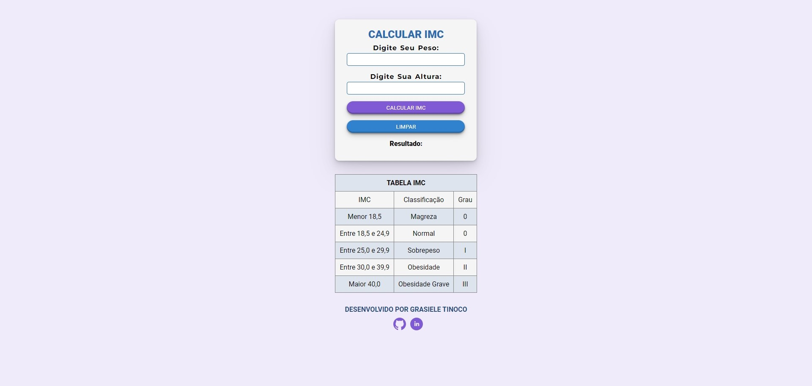

# Calculadora de Índice de Massa Corporal (IMC)

O Índice de Massa Corporal (IMC) é uma medida utilizada para avaliar se uma pessoa está no peso ideal de acordo com sua altura. O cálculo é feito dividindo o peso pela altura ao quadrado.

#### 👉 Como Usar:

Para calcular o IMC, basta fornecer o peso e a altura nos campos especificados. Depois clique em Calcular e compare o resultado na Tabela IMC.

#### 👉 Funcionalidades:

- Calcula o IMC com base no peso e na altura fornecidos pelo usuário.

- Fornece uma classificação do IMC de acordo com a tabela padrão de classificação.

  

#### 🛠️ Tecnologias Utilizadas:

- HTML
- CSS
- JavaScript